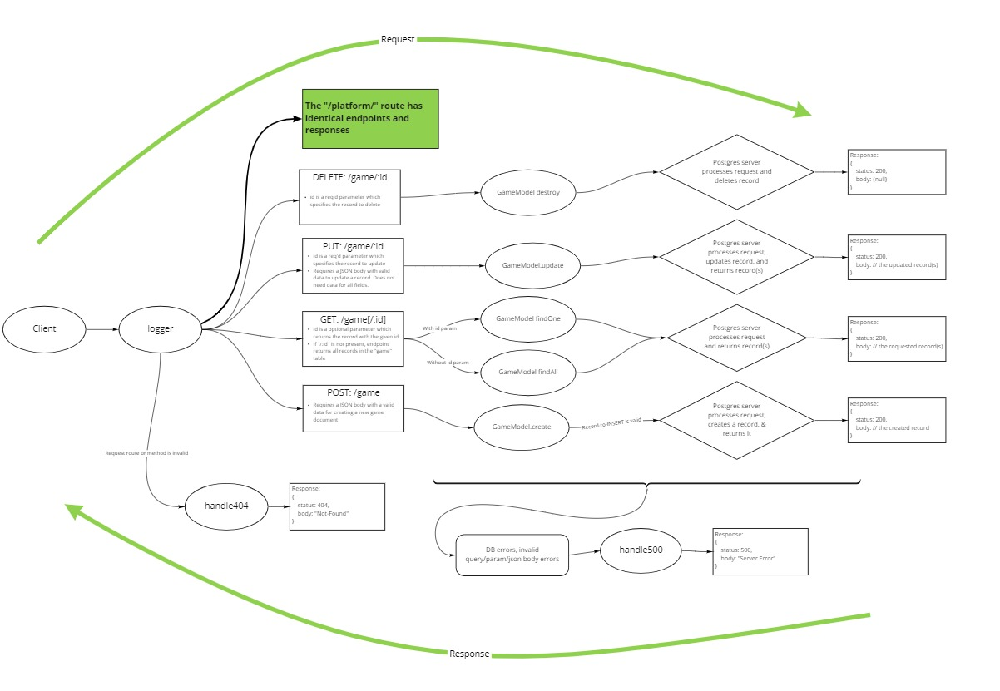

# basic-api-server

A basic API server for storing information about food. Uses Express and a postgres DB to provide full CRUD capability.

[Deployed API](https://jjtech-basic-api-server.herokuapp.com/)

## Installation

1. Clone from this repo `git clone https://github.com/jeffreyjtech/basic-api-server.git`
2. cd into `basic-api-server`
3. `npm install`
4. Optionally, create an .env file with variable `PORT` to assign your preferred port number. The default `PORT` is `3000`.

## Usage

After installation, run `npm start`.

## Contributors / Authors

- Jeffrey Jenkins

## Features / Routes

WIP in Progress
